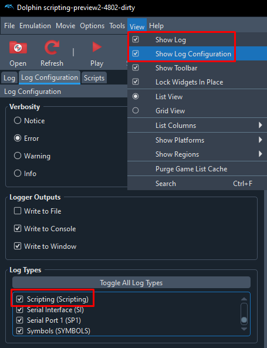

# Using Python scripts with Dolphin

1. Use this fork of Dolphin <https://github.com/Felk/dolphin/releases>.
2. Turn on "Scripting" logs and set Verbosity to "Error" or any option below (not "Notice").\
   
3. Under "Scripts", click "Add new Scripts" and select your Python script.

## Entrance Randomizer (still work in progress!)

### Features

General:

- Generation of Spoiler Log `.txt` file
- Generation of Randomized Map `.graphml` file
- Option to manually choose a seed, or to get a random seed

Transitions:

- Randomization of almost all basic transitions in the game
- Option to manually choose a starting area, or to get a random starting area
- Option to make all transitions 2-directional, or to allow 1-directional transitions
- Option to skip both Jaguar fights entirely, or to keep them as normal
- Option to immediately spawn in the Spirit Fight when entering a temple, or to enter normally

Shaman Shop:

- Randomization of Shaman Shop prices
- Option to disable maps from the Shaman Shop, or to let them remain
- Further options for Shaman Shop prices

### Installing

1. Use this fork of Dolphin <https://github.com/Felk/dolphin/releases>.
2. Turn on "Scripting" logs and set Verbosity to "Error" or any option below (not "Notice").
3. Download the randomizer zip file, either:
    - latest release:
      - from [#randomizer](https://discord.com/channels/334793217138622464/1083867986068254760) channel on Discord;
      - [release artefacts](https://github.com/Avasam/ptle-tools/actions/workflows/pack-randomizer-release.yaml?query=branch%3Amain+is%3Asuccess) (requires a GitHub account);
    - development build:
      - zip it yourself using `pack-rando.ps1`;
      - [development builds](https://github.com/Avasam/ptle-tools/actions/workflows/pack-randomizer.yaml?query=branch%3Amain+is%3Asuccess+event%3Apush) (requires a GitHub account);
4. Open this zip file and drop "Scripts" at the root of your Dolphin installation (the location and names are important!).
5. Configurations are found in `Scripts/Entrance Randomizer/CONFIGS.py`.
6. In Dolphin, under "Scripts", click "Add new Scripts" and select `Scripts/Entrance Randomizer/__main__.py`.
7. Enjoy and watch logs for errors 🙂

### About the `.graphml` file

In order to display the generated map take these steps:

1. Go to <https://graphonline.ru/en/>
2. Under "Graph" choose "Import from file" and choose your generated `.graphml` file
3. Under "Algorithms" choose "Arrange the graph"
4. Enjoy your map! You can freely move the dots, and you can use multiple features under the "Algorithms" tab (like "Find all paths" for instance)
5. You can also save your map at any time by choosing "Graph" --> "Export to file"

### Known issues and limitations

- To generate a new random seed, simply reload the script.
- Saving and Loading is not supported by this randomizer. You can still do it, but the results will be unpredictable.
  - This means "audio glitch", where sometimes the in-game music gets messed up and becomes very loud, currently has no solution while playing the randomizer.
- Some seeds will result in impossible to complete configurations, because you might need some items to progress that you don't have yet.
- When using `LINKED_TRANSITIONS = False` the generated `.graphml` map will become very hard to read, given the extreme amount of connections that will be drawn.
- In rare occasions, a transition might send you to the game-intended level instead of the level decided by the randomizer (this is an issue with the script patching the destination).
- In rare occasions, a transition might not make you enter a level from the correct entrance, but make you enter from the default entrance instead
  - The odds of this happening increase dramatically if at any point in the run Harry died or a save file was loaded.
- Some linked transitions are not spawning at the right entrance and use the default entrance instead. Known cases:
  - Jungle Canyon from Punchau Shrine
  - Bittenbinder's Camp from Mysterious Temple

### Developing

1. Use this fork of Dolphin <https://github.com/Felk/dolphin/releases>.
2. Turn on "Scripting" logs and set Verbosity to "Error" or any option below (not "Notice").
3. Clone this repository.
4. Run `symlink-scripts.ps1 "<path to dolphin-scripting>"`.
5. In Dolphin, under "Scripts", click "Add new Scripts" and select `Scripts/Entrance Randomizer/__main__.py`.

#### Creating a release

This section serves as a reminder for myself. To create a new release:

1. Run [version-bump.ps1](/Dolphin%20scripts/version-bump.ps1)
2. Push to `main`. Any change to `CHANGELOG.md` should trigger a release pack
3. Share on Discord with a link to the latest release section
4. Unpin old version message, pin new version message
