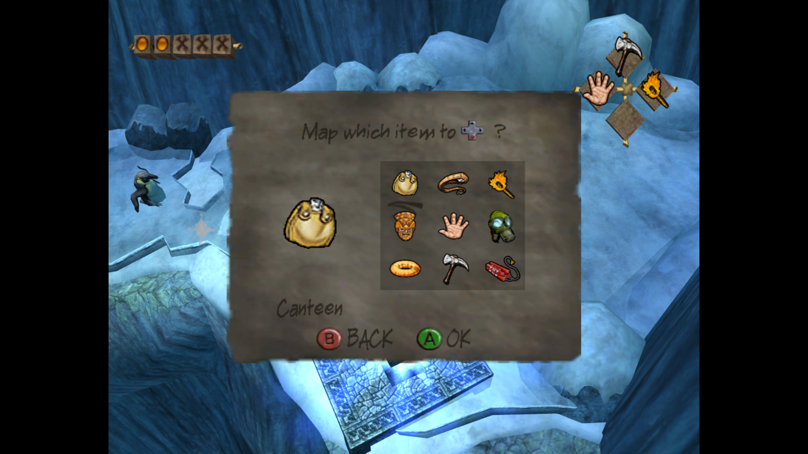
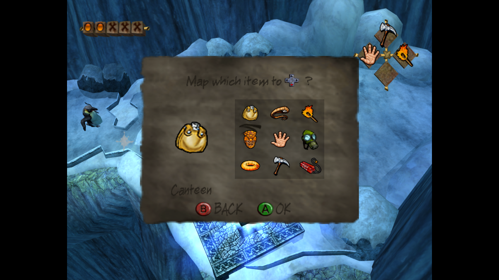
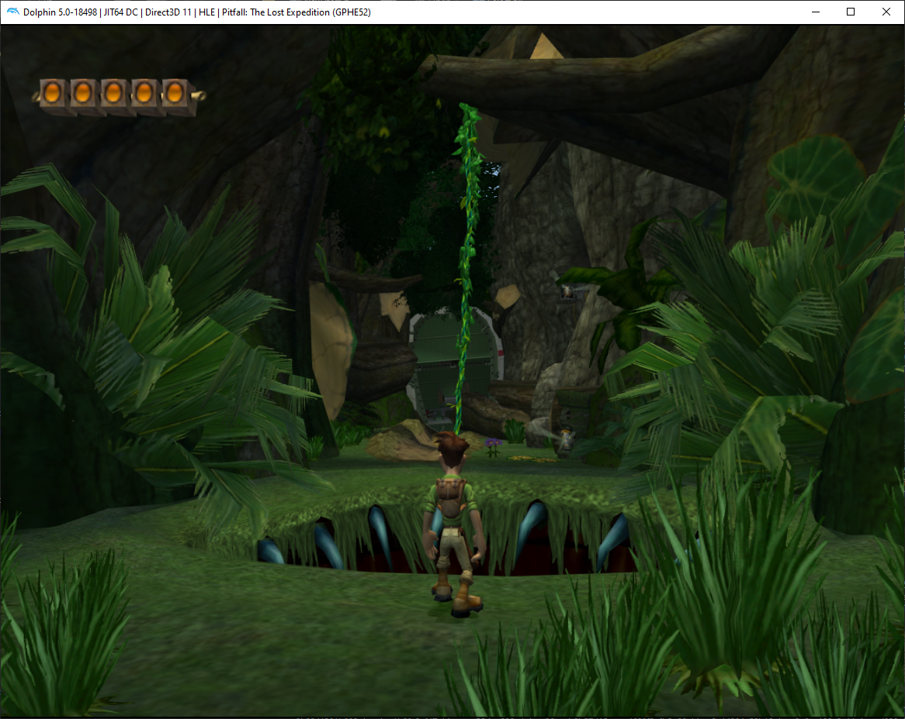
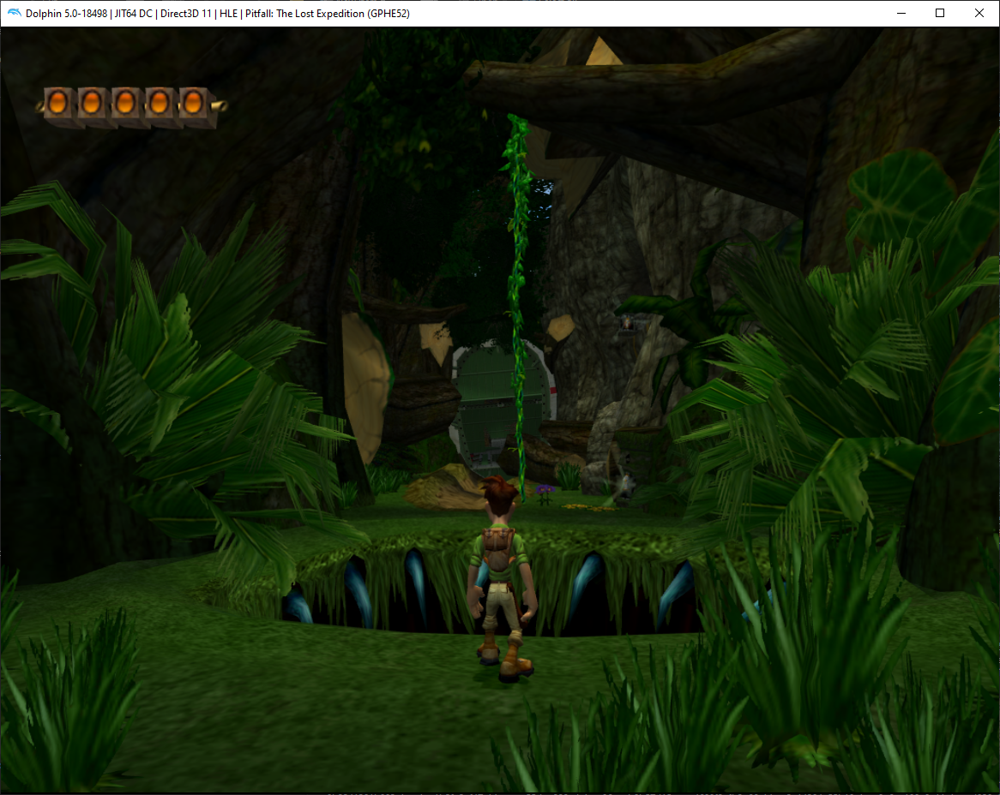

# Generate Dolphin Texture Pack from PC assets

## Usage

1. Have the PC version of "Pitfall: The Lost Expedition" installed
2. [Download the release folder](https://minhaskamal.github.io/DownGit/#/home?url=https://github.com/Avasam/ptle-tools/tree/main/Texture%20packs/Dolphin%20PC%20texture%20pack%20generator/Console%20Generator/bin/Release/net7.0&fileName=PCTexturePackGenerator&rootDirectory=PCTexturePackGenerator) and extract it
3. Run the application
    - Console Application:  
      3.1. Open a terminal of your choice inside the `PCTexturePackGenerator` folder  
      3.2. Run `PCTexturePackGeneratorConsole.exe`
      - When prompted for a path, enter the location of your install. Or just press `Enter` if the default value looks good.
    - GUI Application: GUI app is not complete yet
4. That's it! The texture pack is generated! You can now load it in Dolphin.

## How it works

This application automates the process of generating a Dolphin texture pack from a PC installation through the following steps:

- Extract assets from an existing PC installation using [UltiNaruto's PitfallArcTool](https://github.com/UltiNaruto/PitfallARCTool).
- Convert the raw texture files to a usable format using [Helco's TexConvert](https://github.com/Helco/Pitfall)
- Rename the converted textures to their Dolphin GX texture hash equivalent. The mapping was generated from [Venomalia's Dolphin Texture Extraction tool](https://github.com/Venomalia/DolphinTextureExtraction-tool)'s log file after running it on the US GameCube version.
- Some textures are actually split in Dolphin: Color + Mask, or Palette + Transparency. The same technique as TexConvert on GameCube is used to split the PC textures.

By generating the texture pack yourself, using your own installed assets, this allows us to share this tool completely legally, rather than distributing game assets.

## Examples

|GameCube|PC|
|:-:|:-:|
|||
|||

## Known issues / Planned features

- Output a resource pack instead of just dumping all the texures for a texture pack..
- The fonts texture has a different shape on PC, so smoother PC textures cannot be used directly (this *can* be fixed with a lot of hardcoded image manipulation).
- LOD (Level of Details, aka lower resolution) textures are still used. I wanna go through, find all LOD textures and make this generator use their higher resolution equivalent instead.
- There are *a lot* of unused textures added to the texture pack.
  - Some of them are beta/dev content as well as console-specific textures, those will be easy to spot and exclude.
  - Others are just unused, and there's no easy way to filter them all out.
- I wanna make a simple GUI application with buttons to select the folders and a logs window. Low priority because the console app is still very easy to use.
- Use more and higher quality examples!
